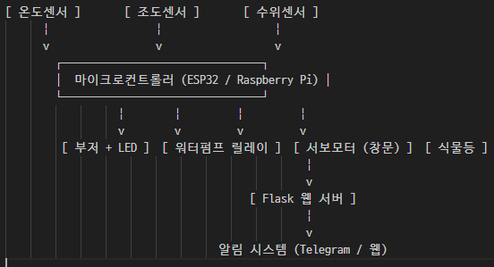

# 📡 스마트팜 IoT 자동제어 시스템 (Smart-Farm-2025)

## 🧾 프로젝트 개요
화재 발생 시 실시간으로 감지하고, 자동으로 경보 및 진압, 환기, 알림 전송까지 수행하는 **IoT 기반 스마트 화재 대응 시스템**입니다. 또한 조도 부족 시 식물등 자동 제어 및 물탱크 수위를 모니터링하는 **스마트팜 기능**도 함께 구현합니다.

---

## ⚙️ 주요 기능 요약

| 기능 | 설명 |
|------|------|
| 🔥 화재 감지 | 온도 70°C 이상 감지 시 부저 울림 + 빨간 LED 점등 + 자동 스프링클러 작동 |
| 📢 경고 알림 | "화재 발생!" 알림을 관리자(웹 or 앱)에게 전송 |
| 🪟 자동 개방 | 화재 발생 시 자동으로 창문 열기 (서보모터 등 사용) |
| 💧 수위 감지 | 물탱크에 물이 일정 수준 이하일 경우 사용자에게 부족 알림 |
| 🌱 조도 감지 | 조도가 부족할 경우 식물등 ON, 충분하면 자동 OFF |

---

## 🛠️ 사용 센서 및 부품 예시

| 센서/모듈 | 역할 |
|-----------|------|
| 온도센서 (ex. DHT11, DS18B20) | 화재 감지용 |
| 부저 + LED (Red/Green) | 시각/청각 경고 |
| 릴레이 모듈 + 워터 펌프 | 자동 물 분사 시스템 |
| 서보모터 or 스텝모터 | 창문 자동 개폐 |
| 수위 센서 | 물탱크 수위 감지 |
| 조도 센서 (ex. BH1750, CDS) | 주변 밝기 측정 |
| 식물등 (LED Bar) | 조도 보완 |
| Raspberry Pi or ESP32 | 제어 및 서버 역할 |
| Flask or Node.js | 웹서버 & 알림용 대시보드 |
| Telegram / 카카오톡 API | 알림 전송 기능 |

---
## ⚙️ 주요 기능

### 🌱 환경 모니터링
- 실시간 온도/습도 측정 및 표시
- 조도 측정 → 조도 부족 시 식물등 점등
- 토양 수분 부족 시 자동 물주기 + 알림

### 🔄 자동 제어 시스템
- **토양 건조 시**: LED 점등 + 부저 + 물 펌프 작동
- **조도 부족 시**: 식물등 ON / 조도 회복 시 OFF
- **습도 높을 시**: 팬 ON → 습도 일정 이하 도달 시 OFF
- **시간 기반 제어**: 특정 시간에 팬 작동

### 🔥 화재 감지 시스템
- 온도 70도 이상 감지 시:
  - 빨간 LED 점등
  - 부저 경고음
  - 미스트 물 분사
  - 알림 전송 (화재 발생 경고)
  - 창문 자동 개방

### 🚨 기타 기능
- **물탱크 수위 낮음** 감지 → 사용자에게 알림
- **수동 버튼**: 물 추가 공급 가능
- **웹 대시보드**: 상태 표시 및 수동 제어 버튼 제공

---

## 🧩 시스템 구성도 (텍스트형)

---

## 📸 시연 영상/이미지 

---

## 💡 면접 질문 대비 포인트

- **Q. 이 프로젝트에서 가장 중요하게 고려한 점은?**  
  → 실시간 반응성과 사용자에게 빠른 경고 전송이 핵심입니다.

- **Q. 센서 오작동이나 통신 실패 시 대비 방안은?**  
  → 센서 값 이상 감지 시 fallback 처리, 예외처리 로직 구현, LED 경고 유지 등 방어 코드 구현

- **Q. 왜 Raspberry Pi/ESP32를 선택했나요?**  
  → 라즈베리파이는 파이썬 기반으로 웹서버와 GPIO 제어가 수월하고, ESP32는 Wi-Fi 모듈 내장으로 원격 제어에 용이합니다.

---

## 📚 포트폴리오 확장 아이디어

- 📸 **화재 발생 시 카메라 자동 촬영 후 전송**
- 📈 **센서 데이터 저장 + 시각화 (DB + Chart.js)**
- 🔌 **배터리 백업 시스템 or 저전력 모드**
- 📱 **모바일 앱 연동 (Flutter, React Native)**

---

## 💡 구현 순서
### 🥇 1단계: **기본 센서 데이터 수집**
- [x] 온습도 센서 → 실시간 값 출력
- [ ] 토양 수분 센서
- [ ] 조도 센서
- [ ] 화재 감지용 온도 센서 (기본은 DHT나 추가 서미스터)

### 🥈 2단계: LED, 부저, 펌프, 팬 제어
- [ ] 일정 조건에서 LED ON/OFF
- [ ] 부저 작동 코드
- [ ] 릴레이로 물펌프/팬 작동 제어

### 🥉 3단계: 조건 기반 자동 제어 로직
- [ ] 토양 수분 부족 시 자동 펌프
- [ ] 조도 낮을 시 LED ON
- [ ] 습도 높을 시 팬 ON
- [ ] 시간 조건으로 팬 ON (Crontab 또는 datetime 사용)

### 🏅 4단계: 화재 알림 시스템
- [ ] 온도 70도 초과 감지 → 알림 + 액션
- [ ] 부저/LED/물 분사 + 창문 개방 (서보모터)

### 🏁 5단계: 웹 대시보드 (Flask)
- [ ] 센서 데이터 표시
- [ ] 수동 제어 버튼 (LED, 팬, 펌프 등)
- [ ] 알림 표시